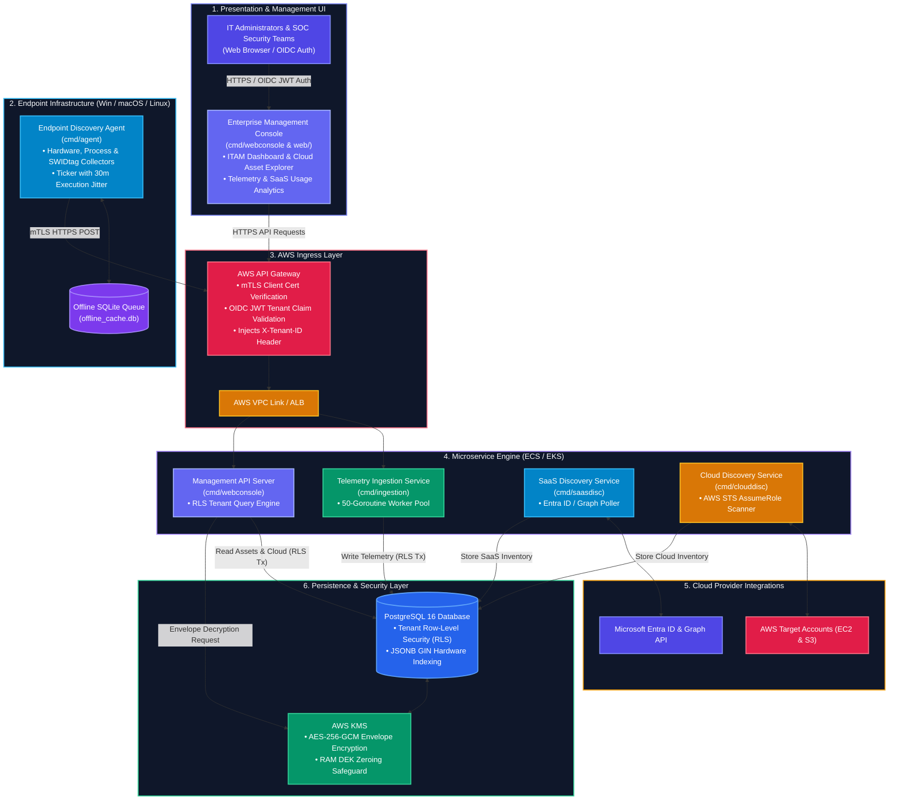
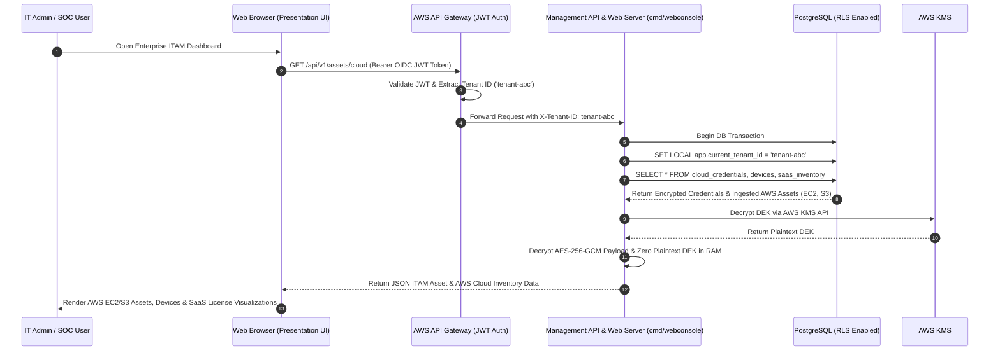
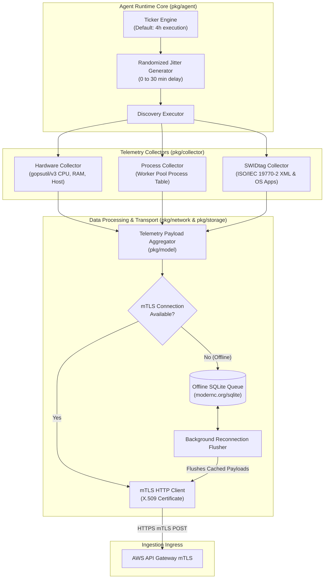
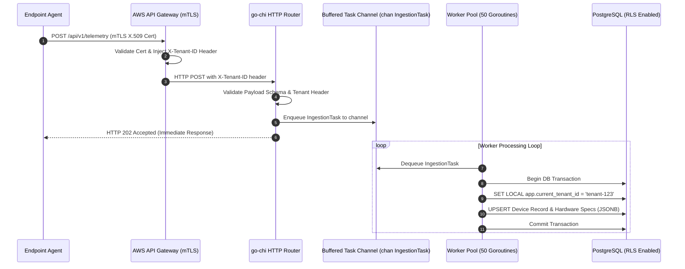
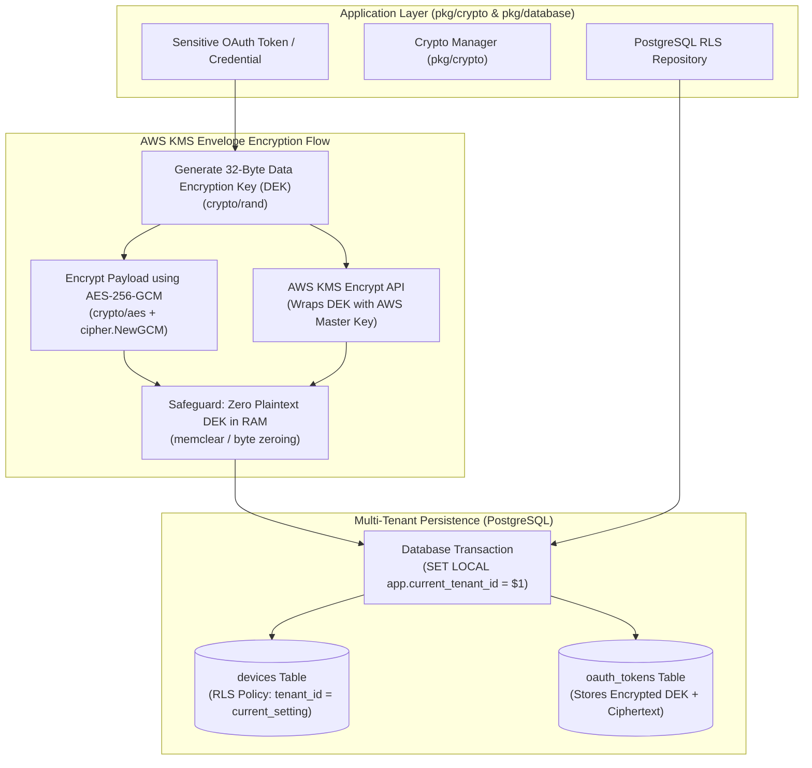
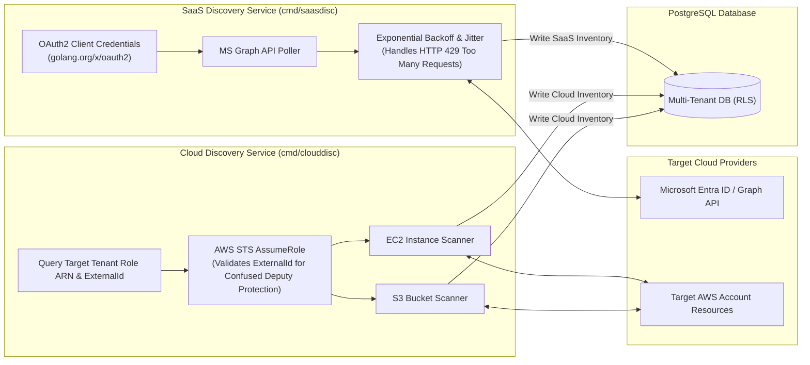
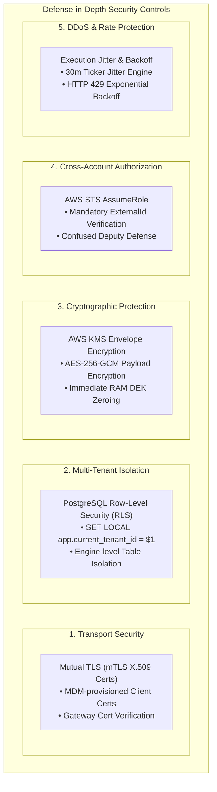
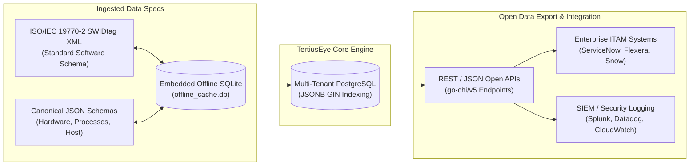

# TertiusEye - Enterprise System Architecture & Component Diagrams

This document details the high-level and subsystem architecture diagrams for **TertiusEye**, an enterprise IT Asset Management (ITAM) distributed SaaS platform built with Golang microservices, multi-platform agent binaries, AWS EKS/ECS Fargate, and PostgreSQL.

---

## 1. High-Level System Architecture Overview

The platform unifies multi-platform endpoint telemetry, SaaS application license discovery, and AWS cloud infrastructure scanning into a central multi-tenant PostgreSQL database protected with Row-Level Security (RLS) and AWS KMS envelope encryption.

The **Presentation Layer (Enterprise Management Web Console)** allows IT administrators and SOC security teams to securely query, inspect, and analyze all ingested ITAM data (Endpoint Telemetry, AWS EC2/S3 Assets, SaaS License Usage) isolated by tenant context.

---

## 2. Presentation Layer & Management Console Retrieval Flow

The Presentation Layer provides IT Administrators with real-time visibility into ingested AWS Cloud Assets (EC2, S3), Endpoint Telemetry, and SaaS License Allocations while maintaining strict multi-tenant Row-Level Security (RLS) and Envelope Decryption.

---

## 3. Endpoint Agent Internal Architecture

The endpoint agent operates cross-platform (Windows, macOS, Linux) in continuous daemon mode, one-shot mode, or interactive local Web UI mode.

---

## 4. High-Concurrency Telemetry Ingestion Pipeline

The Telemetry Ingestion Service handles incoming agent telemetry via a bounded buffer channel feeding a fixed 50-worker goroutine pool.

---

## 5. Multi-Tenant Persistence & Envelope Encryption Flow

Tenant data isolation is enforced at the PostgreSQL engine level via Row-Level Security (RLS). Sensitive credentials use AWS KMS Envelope Encryption with memory-clearing safeguards.

---

## 6. SaaS & Cloud Discovery Microservices Flow

---

## 7. Security Architecture & Controls

TertiusEye incorporates defense-in-depth security mechanisms across transport, storage, cross-account authorization, and application runtime layers.

### Key Security Specifications

1. **Zero-Trust Mutual TLS (mTLS)**:
   - Endpoint agents authenticate to AWS API Gateway using client X.509 certificates provisioned via Enterprise MDM.
   - API Gateway verifies client certificate authenticity and injects `X-Tenant-ID` into downstream headers.

2. **Engine-Level Multi-Tenant Isolation (PostgreSQL RLS)**:
   - Every database table (`devices`, `oauth_tokens`, `cloud_credentials`, `saas_inventory`) enforces `ENABLE ROW LEVEL SECURITY`.
   - Go repository transactions ([`pkg/database/repository.go`](pkg/database/repository.go)) execute `SET LOCAL app.current_tenant_id = $1` prior to executing any SQL queries, preventing cross-tenant data leaks at the database engine level.

3. **Envelope Encryption & RAM Protection**:
   - Generates 32-byte Data Encryption Keys (DEKs) via `crypto/rand`.
   - Encrypts sensitive credentials using AES-256-GCM (`crypto/aes`).
   - Wraps DEKs using AWS KMS `Encrypt` API.
   - **RAM Safeguard**: Plaintext DEK byte slices are explicitly zeroed out in memory (`pkg/crypto/envelope.go`) immediately after encryption to mitigate cold-boot memory scraping.

4. **Confused Deputy Defense**:
   - Cross-account AWS scanning strictly enforces `ExternalId` verification in AWS STS `AssumeRole` calls ([`pkg/cloud/aws.go`](pkg/cloud/aws.go)), protecting target cloud accounts from unauthorized third-party role assumption.

---

## 8. Data Portability & Interoperability Architecture

TertiusEye is architected to avoid vendor lock-in, leveraging open standards, canonical schemas, and standard database DDL for maximum data portability.

### Key Data Portability Features

1. **Standard ISO/IEC 19770-2 SWIDtag Support**:
   - Software discovery leverages international ISO/IEC 19770-2 XML standards ([`pkg/collector/swidtag.go`](pkg/collector/swidtag.go)), ensuring full compatibility and data exportability to enterprise ITAM platforms (ServiceNow, Flexera, Snow Software).

2. **Canonical Open JSON Schemas**:
   - Telemetry metrics use transparent, un-vendor-locked JSON schemas ([`pkg/model/payload.go`](pkg/model/payload.go)), allowing seamless parsing by external analytics or ETL tools.

3. **Offline Caching & Storage Queue**:
   - Embedded SQLite (`modernc.org/sqlite` in [`pkg/storage`](pkg/storage)) queues serialized JSON payloads locally during network outages, maintaining data integrity without data loss.

4. **Database Engine Independence**:
   - Uses standard PostgreSQL 16 DDL with JSONB GIN indexing ([`migrations/001_initial_schema.sql`](migrations/001_initial_schema.sql)).
   - Data can be migrated without code changes across AWS Aurora PostgreSQL, Azure Database for PostgreSQL, Google Cloud SQL, or self-hosted PostgreSQL clusters.

---

## 9. Directory Architecture & Module Mapping

| Directory / Package | Architectural Responsibility | Key Interfaces & Dependencies |
| :--- | :--- | :--- |
| `cmd/agent` | Endpoint Discovery Agent binary entrypoint | Command flags (`-ui`, `-one-shot`), runtime lifecycle |
| `cmd/ingestion` | Telemetry Ingestion Service daemon entrypoint | `go-chi/v5`, PostgreSQL pool, worker configuration |
| `cmd/saasdisc` | SaaS Discovery Service entrypoint | Microsoft Entra ID OAuth2 configuration |
| `cmd/clouddisc` | Cloud Discovery Service entrypoint | AWS SDK v2, STS AssumeRole client |
| `cmd/webconsole` | Presentation Layer Management Console Service | OIDC JWT authentication, RLS query engine, REST API |
| `pkg/agent` | Core ticker discovery engine with jitter | `time.Ticker`, `math/rand` jitter engine |
| `pkg/collector` | Hardware, Process, and SWIDtag collectors | `gopsutil/v3`, ISO/IEC 19770-2 XML parser |
| `pkg/config` | Config JSON parsing and TLS cert validator | `crypto/tls`, `encoding/json` |
| `pkg/crypto` | AWS KMS Envelope Encryption & DEK zeroing | `crypto/aes`, `crypto/cipher`, AWS KMS SDK |
| `pkg/database` | PostgreSQL multi-tenant repository with RLS | `database/sql`, `SET LOCAL app.current_tenant_id` |
| `pkg/ingestion` | Ingestion HTTP router & 50-worker pool | `go-chi/v5`, buffered channel `chan IngestionTask` |
| `pkg/model` | Canonical JSON telemetry models & schemas | Go structs |
| `pkg/network` | mTLS HTTP client & offline buffer flusher | `net/http`, X.509 cert pool |
| `pkg/saas` | MS Graph API client with HTTP 429 backoff | `golang.org/x/oauth2/clientcredentials` |
| `pkg/storage` | Embedded offline SQLite storage queue | `modernc.org/sqlite` |
| `migrations/` | PostgreSQL DDL, GIN indexes, RLS security policies | SQL migrations (`001_initial_schema.sql`) |
| `web/` | Presentation Layer UI (Admin Web Dashboard & Agent UI) | Single-file embedded HTML/CSS/JS dashboard |
