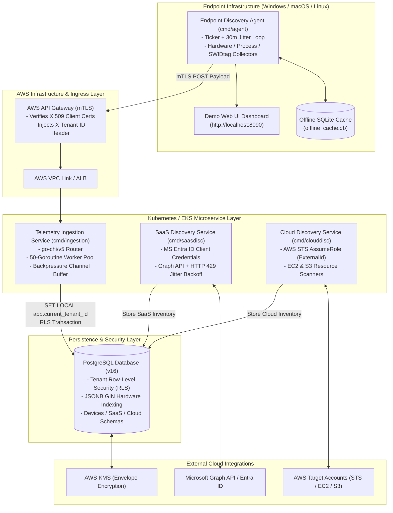
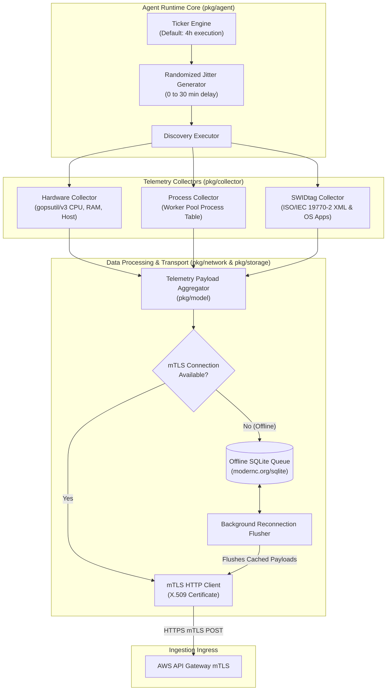
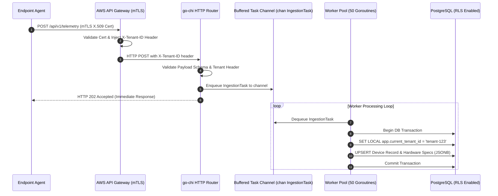
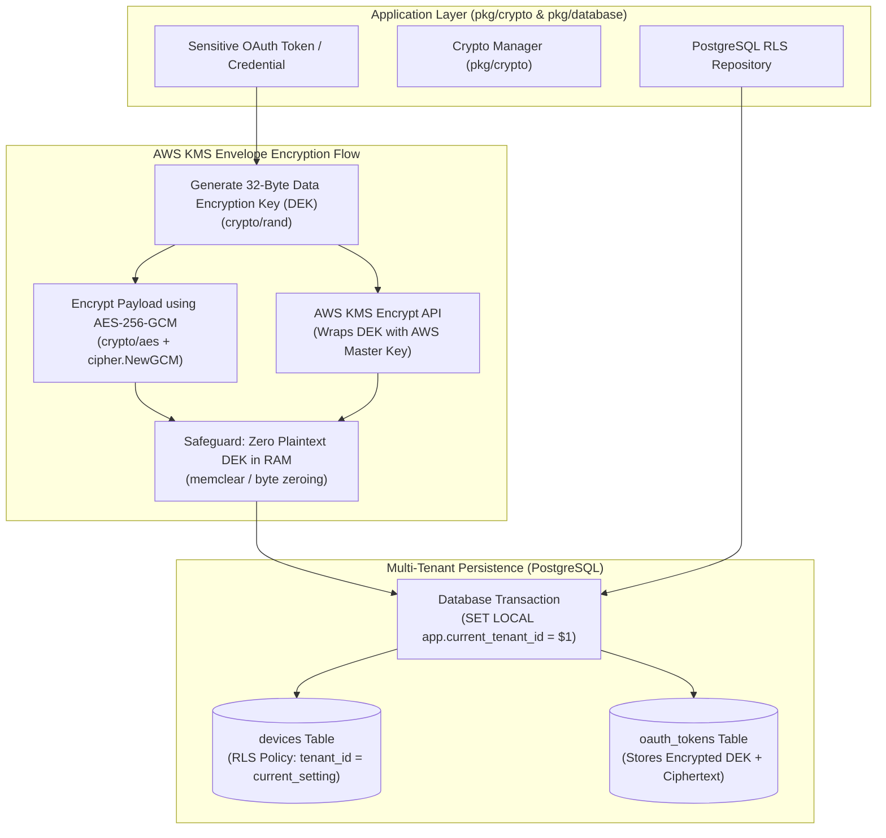
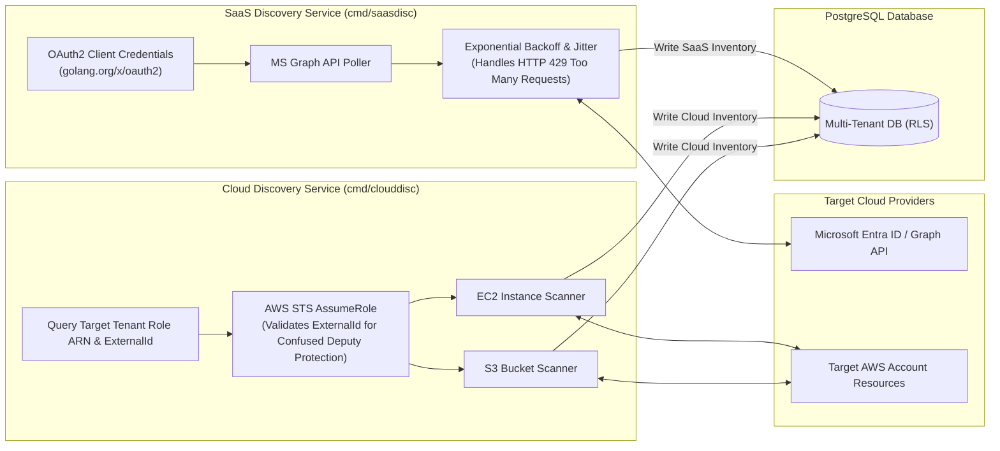

# TertiusEye - Enterprise System Architecture & Component Diagrams

This document details the high-level and subsystem architecture diagrams for **TertiusEye**, an enterprise IT Asset Management (ITAM) distributed SaaS platform built with Golang microservices, multi-platform agent binaries, AWS EKS, and PostgreSQL.

---

## 1. High-Level System Architecture Overview

The platform unifies multi-platform endpoint telemetry, SaaS application license discovery, and AWS cloud infrastructure scanning into a central multi-tenant PostgreSQL database protected with Row-Level Security (RLS) and AWS KMS envelope encryption.

---

## 2. Endpoint Agent Internal Architecture

The endpoint agent operates cross-platform (Windows, macOS, Linux) in continuous daemon mode, one-shot mode, or interactive local Web UI mode.

---

## 3. High-Concurrency Telemetry Ingestion Pipeline

The Telemetry Ingestion Service handles incoming agent telemetry via a bounded buffer channel feeding a fixed 50-worker goroutine pool.

---

## 4. Multi-Tenant Persistence & Envelope Encryption Flow

Tenant data isolation is enforced at the PostgreSQL engine level via Row-Level Security (RLS). Sensitive credentials use AWS KMS Envelope Encryption with memory-clearing safeguards.

---

## 5. SaaS & Cloud Discovery Microservices Flow

---

## 6. Directory Architecture & Module Mapping

| Directory / Package | Architectural Responsibility | Key Interfaces & Dependencies |
| :--- | :--- | :--- |
| `cmd/agent` | Endpoint Discovery Agent binary entrypoint | Command flags (`-ui`, `-one-shot`), runtime lifecycle |
| `cmd/ingestion` | Telemetry Ingestion Service daemon entrypoint | `go-chi/v5`, PostgreSQL pool, worker configuration |
| `cmd/saasdisc` | SaaS Discovery Service entrypoint | Microsoft Entra ID OAuth2 configuration |
| `cmd/clouddisc` | Cloud Discovery Service entrypoint | AWS SDK v2, STS AssumeRole client |
| `pkg/agent` | Core ticker discovery engine with jitter | `time.Ticker`, `math/rand` jitter engine |
| `pkg/collector` | Hardware, Process, and SWIDtag collectors | `gopsutil/v3`, ISO/IEC 19770-2 XML parser |
| `pkg/config` | Config JSON parsing and TLS cert validator | `crypto/tls`, `encoding/json` |
| `pkg/crypto` | AWS KMS Envelope Encryption & DEK zeroing | `crypto/aes`, `crypto/cipher`, AWS KMS SDK |
| `pkg/database` | PostgreSQL multi-tenant repository with RLS | `database/sql`, `SET LOCAL app.current_tenant_id` |
| `pkg/ingestion` | Ingestion HTTP router & 50-worker pool | `go-chi/v5`, buffered channel `chan IngestionTask` |
| `pkg/model` | Canonical JSON telemetry models & schemas | Go structs |
| `pkg/network` | mTLS HTTP client & offline buffer flusher | `net/http`, X.509 cert pool |
| `pkg/saas` | MS Graph API client with HTTP 429 backoff | `golang.org/x/oauth2/clientcredentials` |
| `pkg/storage` | Embedded offline SQLite storage queue | `modernc.org/sqlite` |
| `migrations/` | PostgreSQL DDL, GIN indexes, RLS security policies | SQL migrations (`001_initial_schema.sql`) |
| `web/` | Embedded single-file interactive Demo Web UI | Embedded HTML/JS dashboard |
