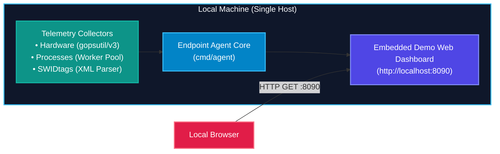
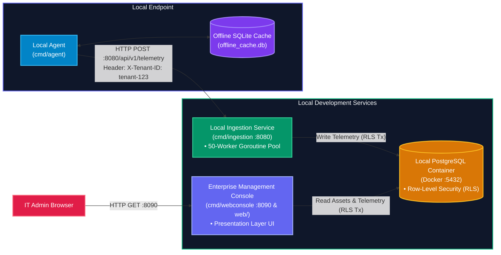
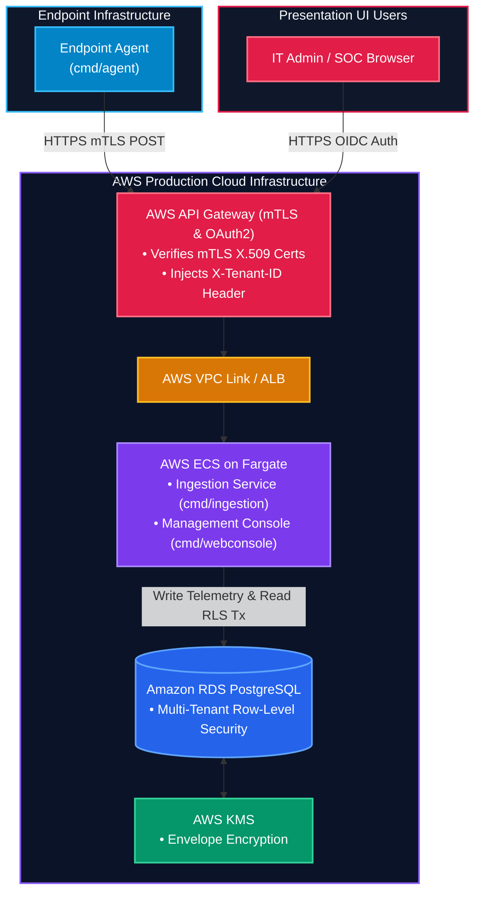
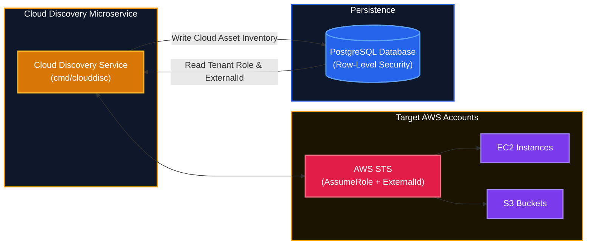
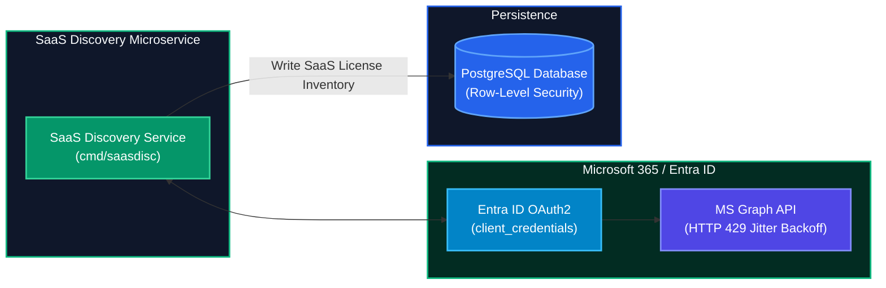

# TertiusEye - Progressive Implementation Plan & Roadmap

This document defines the 5-phase execution plan for building, testing, and deploying **TertiusEye**, an enterprise IT Asset Management (ITAM) distributed SaaS platform.

> ℹ️ *For complete system architecture diagrams and subsystem component flows, see [ARCHITECTURE.md](ARCHITECTURE.md).*

---

## Execution Phases Overview

```mermaid
flowchart LR
    P1["Phase 1:<br/>Local Agent & Demo UI"] --> P2["Phase 2:<br/>Local Agent & Ingestion"]
    P2 --> P3["Phase 3:<br/>AWS Ingestion System"]
    P3 --> P4["Phase 4:<br/>Cloud Discovery Integration"]
    P4 --> P5["Phase 5:<br/>SaaS Discovery Integration"]

    classDef p1 fill:#0ea5e9,stroke:#0284c7,stroke-width:2px,color:#ffffff;
    classDef p2 fill:#3b82f6,stroke:#2563eb,stroke-width:2px,color:#ffffff;
    classDef p3 fill:#8b5cf6,stroke:#7c3aed,stroke-width:2px,color:#ffffff;
    classDef p4 fill:#f59e0b,stroke:#d97706,stroke-width:2px,color:#ffffff;
    classDef p5 fill:#10b981,stroke:#059669,stroke-width:2px,color:#ffffff;

    class P1 p1;
    class P2 p2;
    class P3 p3;
    class P4 p4;
    class P5 p5;
```



---

## Phase 1: Local Agent & Local Interactive UI (Demo Mode)

### Objective
Run the cross-platform endpoint agent locally with zero external DB or AWS cloud dependencies. Render hardware metrics, process tables, and ISO/IEC 19770-2 `.swidtag` software inventory interactively using the embedded single-file web dashboard.

### Architecture Diagram


### Components Involved
- [`cmd/agent/main.go`](cmd/agent/main.go): Flag parsing (`-ui`, `-port 8090`, `-one-shot`), runtime lifecycle.
- [`pkg/collector/`](pkg/collector/): `HardwareCollector`, `ProcessCollector`, `SWIDCollector`.
- [`web/index.html`](web/index.html): Embedded single-file glassmorphism HTML/JS dashboard.

### Execution Commands
```bash
# 1. Build local binary for current platform
make build-agent

# 2. Run in Interactive Demo Web UI Mode
make demo
# OR
./bin/tertiuseye-agent-darwin-arm64 -config config.example.json -ui -port 8090
```

### Verification
- Open `http://localhost:8090` in your web browser.
- Verify CPU usage gauges, memory stats, process list, and installed `.swidtag` applications update live.

---

## Phase 2: Local Agent, Ingestion & Presentation Web Console (Local Environment)

### Objective
Decouple the agent from local display mode and run a standalone telemetry ingestion microservice backed by a local PostgreSQL database container with multi-tenant Row-Level Security (RLS). 

**Presentation Layer Integration**: Introduces the production **Enterprise Management Web Console (`cmd/webconsole` / `web/`)**, which connects directly to the local PostgreSQL database to query, decrypt, and display ingested device telemetry and asset inventory under RLS protection. All components run locally without AWS dependencies.

### Architecture Diagram


### Components Involved
- [`Dockerfile`](Dockerfile): Multi-stage Docker build definition for containerizing `agent`, `ingestion-service`, `cloud-discovery-service`, and `saas-discovery-service`.
- [`docker-compose.yml`](docker-compose.yml): Multi-container orchestration stack (`tertiuseye-postgres`, `tertiuseye-ingestion`, `tertiuseye-webconsole`, `tertiuseye-agent`).
- [`cmd/ingestion/main.go`](cmd/ingestion/main.go): Ingestion service daemon entrypoint running inside `tertiuseye-ingestion` container.
- [`cmd/webconsole/main.go`](cmd/webconsole/main.go) & [`web/index.html`](web/index.html): **Presentation Layer** web console running inside `tertiuseye-webconsole` container (`:8090`).
- [`migrations/001_initial_schema.sql`](migrations/001_initial_schema.sql): PostgreSQL schema initializing RLS security policies.

### Execution Commands (Containerized Stack)
```bash
# 1. Build and launch all containerized services in background (PostgreSQL, Ingestion, Web Console, Agent)
docker compose up --build -d
# OR (if using legacy docker-compose CLI)
docker-compose up --build -d

# 2. Inspect running container status
docker compose ps

# 3. Stream live logs from Telemetry Ingestion container
docker compose logs -f ingestion-service

# 4. Open Presentation Web Console in browser (http://localhost:8090)
open http://localhost:8090

# 5. Query local PostgreSQL container to verify device telemetry persistence under RLS
docker exec -it tertiuseye-postgres psql -U postgres -d tertiuseye -c "SELECT count(*) FROM devices;"

# 6. Tear down container stack when testing is complete
docker compose down
```

### Verification
- Open Presentation Web Console at `http://localhost:8090` in your browser.
- Verify ingested device hardware, process lists, and `.swidtag` software records stored in local PostgreSQL are rendered on the dashboard under active tenant isolation.

---

## Phase 3: Local Agent & AWS Telemetry Ingestion System

### Objective
Promote the local ingestion and presentation setup to production-grade AWS cloud infrastructure using AWS API Gateway mTLS/OAuth2 authentication, AWS ECS on Fargate, and Amazon RDS PostgreSQL with envelope encryption.

**Presentation Layer Continuity**: The **exact same Enterprise Management Web Console (`cmd/webconsole`)** introduced in Phase 2 is deployed to AWS ECS Fargate, querying Amazon RDS PostgreSQL with RLS transactions and performing DEK decryption requests via AWS KMS.

### Architecture Diagram


### Components Involved
- [`cmd/webconsole/main.go`](cmd/webconsole/main.go): Presentation Layer web console deployed to AWS ECS Fargate.
- [`pkg/network/client.go`](pkg/network/client.go): mTLS HTTP client with X.509 client certificate support.
- [`pkg/crypto/envelope.go`](pkg/crypto/envelope.go): AWS KMS Envelope Encryption & DEK memory zeroing.
- **AWS Services**: AWS API Gateway, AWS VPC Link, AWS ECS Fargate, Amazon RDS PostgreSQL, AWS KMS.

### Execution Commands
```bash
# 1. Build container images & push to AWS ECR
docker build -t tertiuseye/ingestion-service -f Dockerfile.ingestion .
docker push 123456789012.dkr.ecr.us-east-1.amazonaws.com/tertiuseye/ingestion-service:latest

# 2. Deploy infrastructure via Terraform / CloudFormation
terraform apply

# 3. Run Agent with mTLS certificate targeting AWS API Gateway
./bin/tertiuseye-agent-darwin-arm64 -config config.prod.json -endpoint https://api.tertiuseye.internal/api/v1/telemetry
```

### Verification
- Verify AWS API Gateway logs show valid client X.509 certificate validation and `X-Tenant-ID` header injection.
- Confirm RDS PostgreSQL contains multi-tenant records protected by RLS.

---

## Phase 4: Cloud Discovery Integration

### Objective
Integrate the Cloud Discovery Microservice (`cmd/clouddisc`) to scan target AWS accounts for EC2 instances and S3 buckets using AWS STS `AssumeRole` with `ExternalId` protection against Confused Deputy attacks.

### Architecture Diagram


### Components Involved
- [`cmd/clouddisc/main.go`](cmd/clouddisc/main.go): Cloud discovery entrypoint.
- [`pkg/cloud/aws.go`](pkg/cloud/aws.go): `CloudScanner` implementing STS `AssumeRole`, EC2 scanning, and S3 bucket listing.
- [`pkg/cloud/aws_test.go`](pkg/cloud/aws_test.go): Unit tests validating `ExternalId` parameter safety.

### Execution Commands
```bash
# 1. Build Cloud Discovery Service binary
make build-clouddisc

# 2. Execute cross-account scan
./bin/cloud-discovery-service -role-arn "arn:aws:iam::123456789012:role/TertiusEyeCrossAccountRole" -external-id "tenant-external-id-secret-999"
```

### Verification
- Check command output: `[Cloud Discovery Service] Discovered X EC2 instances and Y S3 buckets.`
- Run unit test suite: `go test -v ./pkg/cloud/...` to confirm `AssumeRole` validation passes.

---

## Phase 5: SaaS Discovery Integration

### Objective
Integrate the SaaS Discovery Microservice (`cmd/saasdisc`) to poll Microsoft Entra ID and Microsoft Graph API for SaaS application allocations, active user licenses, and application activity with HTTP 429 backoff jitter protection.

### Architecture Diagram


### Components Involved
- [`cmd/saasdisc/main.go`](cmd/saasdisc/main.go): SaaS discovery entrypoint.
- [`pkg/saas/client.go`](pkg/saas/client.go): MS Graph API client with OAuth2 `client_credentials` and exponential backoff on HTTP 429 `TooManyRequests`.

### Execution Commands
```bash
# 1. Build SaaS Discovery Service binary
make build-saasdisc

# 2. Run SaaS discovery polling
./bin/saas-discovery-service -tenant "your-tenant-uuid" -client-id "your-client-id" -client-secret "your-secret"
```

### Verification
- Confirm Entra ID OAuth2 authentication obtains bearer tokens.
- Verify license allocation details are written to the database under tenant RLS protection.

### Open questions
- How to test the phase3 in a customer like env?
- Need more inputs and way to test phase4 and further. 
- Testing needs to be rigorous